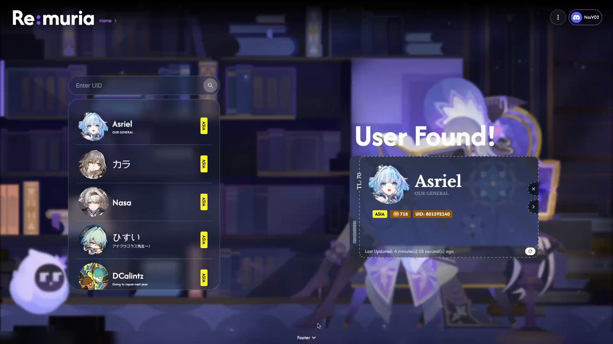

# Re:muria — Honkai: Star Rail 

A visually rich and data-driven full-stack web application built for **Honkai: Star Rail** players to view detailed user stats, relic builds, rankings and damage calculations — powered by the [Enka.Network API](https://api.enka.network/#/).

> ⚙️ *Work in Progress — actively being developed with a focus on UI fluidity, efficient data visualization, and Neo4j-powered relationship mapping.*

---

## ✨ Demo Previews

<table align="center">
<tr>
<td align="center">
  
   
  <b>Homepage & UID Search</b>
</td>
</tr>
<tr>
<td align="center">
  
   
  <b>User Found & Info Card</b>
</td>
</tr>
<tr>
<td align="center">
  
   
  <b>User Dashboard & Relics Display</b>
</td>
</tr>
</table>

---

## 🧩 Tech Stack

| Layer | Technologies Used |
|:------|:------------------|
| **Frontend** | ReactJS, TailwindCSS, React-Redux, Framer Motion |
| **Backend** | Java Spring Boot, Swagger UI |
| **Database** | MongoDB, Neo4j (for relational character data mapping) |
| **API Source** | [Enka.Network API](https://api.enka.network/#/) |
| **Architecture** | MVC (Model-View-Controller) |

---

## 🌠 Features (Planned & Implemented)

### ✅ Implemented
- UID-based player search  
- Dynamic dashboard displaying user stats and relics  
- Smooth animated UI transitions and card displays  
- Real-time data fetch from Enka API
- User login and personalized dashboards  

### 🚧 In Progress
- Damage calculator (based on character build and relic stats)  
- Relic database browser  
- Build rankings 

